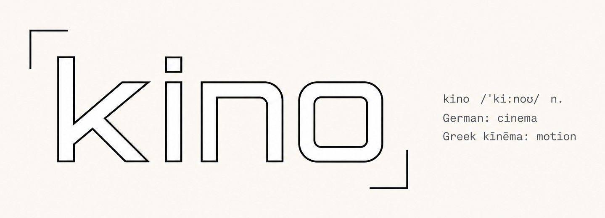

<p align="center">
  
</p>

<p align="center"><em>Agent-driven short-form video production — spec in, video out.</em></p>

---

**kino** turns an agent-authored JSON spec into finished vertical videos:
ElevenLabs voiceover → optional AI avatar (HeyGen / Hedra / Replicate) or **faceless** → Remotion composite → 9:16 / 3:4 MP4.
The agent supplies the creative; `kino` handles deterministic production.

- **Design spec:** [`docs/superpowers/specs/2026-06-15-kino-design.md`](docs/superpowers/specs/2026-06-15-kino-design.md)
- **Implementation plan:** [`docs/superpowers/plans/2026-06-15-kino.md`](docs/superpowers/plans/2026-06-15-kino.md)

> **Status:** v1.11 — word captions highlight the spoken word + the brand name in brand green
> (single highlight colour); keyframe easings incl. spring/overshoot; every overlay tweenable
> (logo + captions + kickers, one keyframe system), configurable logo, agent-animatable backgrounds
> (keyframes/triggers + word timestamps), projects (brand-assignable file scoping), avatar providers,
> faceless mode, avatar-trim, word-synced captions, on-demand fonts, agent inspection
> (inspect/still/storyboard/frames/backgrounds/elements), output tagging, `--mock`, caching, `doctor`. 74 tests green.

## Install (global)
```bash
cd <your-project> && bash ~/kino/setup.sh   # installs the `kino` command + writes a project .env
```
`setup.sh` runs `npm install`/`build`/`link` and prompts for API keys (written to a `chmod 600`,
git-ignored `.env`). Or do it by hand:
```bash
cd ~/kino && npm install && npm run build && npm link   # provides the `kino` command
```
Requires Node 18+, ffmpeg/ffprobe (+ ImageMagick for storyboards). Faceless needs only an ElevenLabs key.

## Use
```bash
cd <project> && kino init evidentcv     # scaffold .env, brand, dirs
# ...fill brand.json (voiceAliases/lookAliases), add assets/, write specs/
kino doctor
kino build specs/lie-test.json --mock   # free structural preview (no API spend)
kino build specs/lie-test.json          # real render → out/lie-test/
```
The driving agent authors specs — see [`skills/video-production`](skills/video-production/SKILL.md).

## Pipeline & options (v1.1)
- **Avatar engine** — `provider` (spec) / `defaultProvider` (brand) / `--provider`:
  `none` (faceless, $0), `heygen` (Avatar-IV), `hedra` (Character-3), `replicate` (open-source lip-sync).
  Avatars are **trimmed to on-camera segments** to cut spend; VO + avatar are content-hash cached.
- **Faceless backgrounds** — `background` / `--background`: `glow`, `image`, `mesh`, `aurora`,
  `particles`, `grid`, `custom` — frame-deterministic Canvas2D, auto-coloured from the brand.
- **Captions** — `captionMode`: `phrase` (short editorial block) or `words` (spoken text revealed
  word-by-word, synced to real VO timestamps; active-word highlight + per-segment `emphasis`).
- **Fonts** — `brand.font`/`labelFont` accept a curated font name (`kino fonts`) downloaded on demand
  (Google Fonts → cached `~/.kino/fonts/`), loaded into the render; or any raw CSS family.
- **Animated backgrounds** — `kino backgrounds` exposes each preset's params (colours/intensity) + actions
  (pulse); agents tween them via `backgroundKeyframes` and fire `backgroundTriggers` at timestamps
  (sync with `kino inspect` word times). Custom draw fns get `env.params` + `env.pulse`.
- **Overlay elements** — `kino elements`: the logo has size (`small`/`medium`/`big`/px) + position
  (cardinal/center/custom) presets; **logo, captions, and kickers** are all tweenable
  (`logoKeyframes` / `captionKeyframes` / `kickerKeyframes` — x/y/scale/opacity) on one shared keyframe layer.
- **Branding** — `logo` mark on talking beats + a per-mode AI `disclosure` baked in.
- **Output** — `out/<title>/<title>[-<tag>]-<format>.mp4`; `--tag` (auto-set from `--background`)
  keeps variant renders side-by-side instead of overwriting.
- **Compliance** — brand `bannedPhrases` fail the build (no guaranteed-outcome copy).
- **Inspect & iterate** — `kino inspect` (plan as JSON), `kino still`/`storyboard` (fast mock previews
  via Remotion `renderStill`), `kino frames` (extract from a render). Built for tight agent loops:
  map beats → preview a beat → edit spec → re-preview → `build`.
- **Projects** — `projects/<name>/` scopes each campaign's `specs/assets/out`; `project.json` assigns a
  shared brand + default overrides. `kino projects` lists/scaffolds. Flat layout still works (back-compat).

## Brand assets (`logo/`)
| File | Use |
|---|---|
| `kino-logo.png` | **Light master** — wordmark + etymology note (cream); used in this README |
| `kino-wordmark.png` | Wordmark + brackets only |
| `kino-logo-transparent.png` | Transparent (line-art; for **light** backgrounds) |
| `kino-logo-dark.png` | **Dark master** — white ink on night |
| `kino-logo-dark-transparent.png` | Transparent dark-mode (overlay on **dark**) |
| `kino-icon.png` | 1024×1024 square icon |
