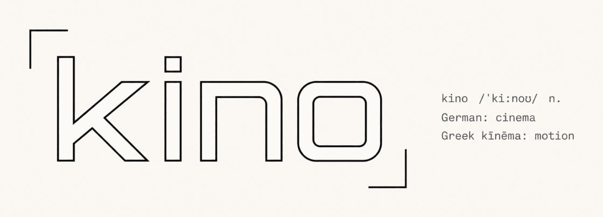

<p align="center">
  
</p>

<p align="center"><em>Agent-driven short-form video production</em></p>

<p align="center">
  <a href="LICENSE"></a>
  
  
  
</p>

---

**kino** turns an agent-authored JSON spec into finished vertical videos. The driving agent supplies
the creative; kino handles deterministic production: ElevenLabs voiceover, an optional AI avatar
(HeyGen / Hedra / Replicate) or a **faceless** background, composited in Remotion to a 9:16 / 3:4 MP4.

## Pipeline at a glance
```
spec.json ─▶ validate ─▶ voiceover (ElevenLabs) ─▶ avatar plan + trim
          ─▶ avatar (HeyGen/Hedra/Replicate) or faceless background
          ─▶ Remotion composite ─▶ ffmpeg ─▶ out/<title>/…mp4
```
The agent authors specs; kino performs every step deterministically (no LLM inside the CLI).

## Install
```bash
git clone https://github.com/sdkv2/kino.git ~/kino     # clone the toolchain once
cd <your-project> && bash ~/kino/setup.sh              # install `kino` + write a project .env
```
`setup.sh` is a guided installer: prerequisite checks (Node 18+, ffmpeg, ImageMagick — offers to
install what's missing), `npm install` / `build` / `link`, then an API-key walkthrough (written to a
`chmod 600`, git-ignored `.env`). Manual install:
```bash
cd ~/kino && npm install && npm run build && npm link
```
Requires Node 18+, ffmpeg/ffprobe (+ ImageMagick for storyboards). Faceless needs only an ElevenLabs key.

## Quickstart
```bash
cd <project> && kino init evidentcv     # scaffold .env, brand.md, dirs
kino doctor                             # preflight: API keys, ffmpeg/ffprobe, heygen CLI
kino build specs/lie-test.json --mock   # free structural preview (no API spend)
kino build specs/lie-test.json          # real render → out/lie-test/
```

## Agent skills

Playbooks live in [`skills/`](skills/) (`video-production`, `ad-voice`, `adversarial-critique`).
Canonical source in this repo; agents discover them via their usual skill dirs.

**From any project** (Cursor / Claude Code / Codex / …):

```bash
npx skills add sdkv2/kino
# or one skill:  npx skills add sdkv2/kino@ad-voice
```

**Inside a kino workspace** (after clone / `npm link`):

```bash
kino skills --install                 # → .agents .cursor .claude .codex (also run by kino init)
kino skills --install --agents cursor,claude
```

Browse / leaderboard: [skills.sh](https://skills.sh) (appears after installs). Details: [`skills/README.md`](skills/README.md).

## Features
- **Avatar engines** — `none` (faceless, $0), `heygen` (Avatar-IV), `hedra` (Character-3),
  `replicate` (open-source lip-sync). Avatars are trimmed to on-camera segments to cut spend;
  VO + avatar are content-hash cached.
- **Faceless backgrounds** — `glow`, `image`, `mesh`, `aurora`, `particles`, `grid`, `custom` —
  frame-deterministic Canvas2D, auto-coloured from the brand.
- **Captions** — `phrase` (editorial block) or `words` (revealed word-by-word, synced to real VO
  timestamps, with active-word highlight + per-segment emphasis).
- **Fonts** — curated names (`kino fonts`) downloaded on demand (Google Fonts → `~/.kino/fonts/`),
  or any raw CSS family.
- **Stock media** — `kino pexels` (video) and `kino photos` (stills) search Pexels (portrait-first)
  into project assets; same `PEXELS_API_KEY`. `.mp4` / `.jpg` work in app cut-ins.
- **Animated backgrounds & overlays** — backgrounds, logo, captions, and kickers are all tweenable
  on one keyframe layer (`backgroundKeyframes`/`logoKeyframes`/…), with timed `backgroundTriggers`.
- **Motion graphics** — author a self-contained HTML/CSS file in `assets/motion/`; kino drives it
  per-frame via CSS variables, with scrubbed `@keyframes` and a `.kino-cliptext` helper, sanitized
  and determinism-linted. See [docs/motion-graphics.md](docs/motion-graphics.md).
- **Branding & compliance** — logo mark + a per-mode AI `disclosure`; brand `bannedPhrases` fail
  the build (no guaranteed-outcome copy).
- **Inspect & iterate** — `inspect` (plan as JSON), `still`/`storyboard` (fast mock previews),
  `frames` (extract from a render). Built for tight agent loops.
- **Brands & projects** — `brands/<name>/brand.md` (markdown frontmatter + guidelines) is shared;
  every build runs inside a `projects/<name>/` (its own specs/assets/out + a `project.json` that
  assigns a brand). `kino init <brand>` scaffolds the first one; `kino projects --new` adds more.

## Documentation
Full guides live in [`docs/`](docs/):
- [Getting started](docs/getting-started.md) — install, scaffold, first render.
- [CLI reference](docs/cli-reference.md) — every command + flag.
- [Spec reference](docs/spec-reference.md) — the JSON spec, `brand.md`, `project.json`.
- [Motion graphics](docs/motion-graphics.md) — author custom animated beats/overlays in HTML/CSS.
- [Backgrounds & overlays](docs/backgrounds-and-overlays.md) — faceless backgrounds, logo, captions, kickers.

## Development
```bash
npm run build     # tsc → dist/
npm test          # vitest (run once);  npm run test:watch to watch
npm run dev -- <args>   # run the CLI from source via tsx
```
Work on a feature branch (`feat/…`, `fix/…`, `chore/…`), bump `version` in `package.json` for
releases, and open a PR to `main`. Version history lives in [`CHANGELOG.md`](CHANGELOG.md).

## License

[MIT](LICENSE) © sdkv2
